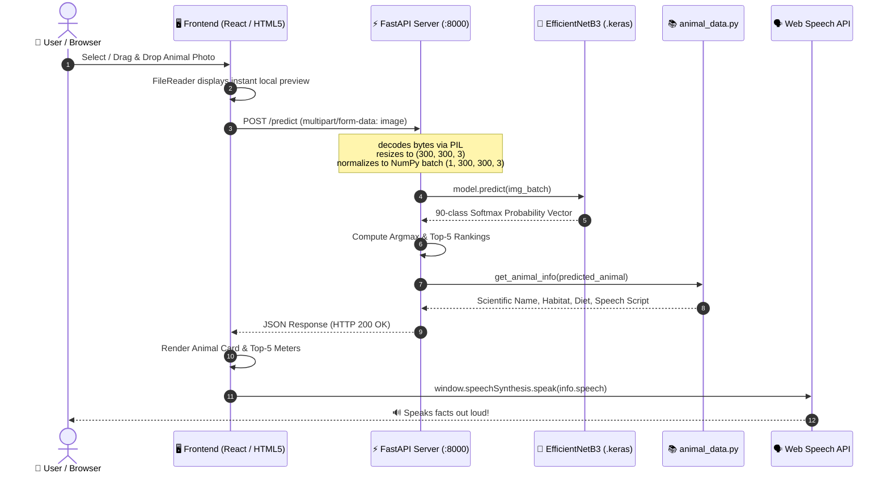

# 🐾 Animal Vision AI — Complete Project Guide & System Architecture

An exhaustive technical and architectural guide for the **90-Class Animal Image Classification & Voice Encyclopedia System**.

This document covers everything from **foundational concepts** to **advanced deep learning theory**, and details the **exact connection pipeline between the frontend and backend**.

---

## 📑 Table of Contents
1. [Project Overview & Core Mission](#1-project-overview--core-mission)
2. [High-Level Architecture Diagram](#2-high-level-architecture-diagram)
3. [The Deep Learning Model (Advanced AI Details)](#3-the-deep-learning-model-advanced-ai-details)
   - [Why EfficientNetB3?](#why-efficientnetb3)
   - [Compound Scaling Principle](#compound-scaling-principle)
   - [Data Augmentation Pipeline](#data-augmentation-pipeline)
   - [Two-Stage Transfer Learning & Fine-Tuning](#two-stage-transfer-learning--fine-tuning)
   - [Inference & Probability Distribution (Softmax)](#inference--probability-distribution-softmax)
   - [Confidence Tiers & Out-of-Distribution Limitations](#confidence-tiers--out-of-distribution-limitations)
4. [Frontend & Backend Connection (Detailed Breakdown)](#4-frontend--backend-connection-detailed-breakdown)
   - [Step-by-Step Request-Response Flow](#step-by-step-request-response-flow)
   - [Client-Side (Frontend) Code Explained](#client-side-frontend-code-explained)
   - [Server-Side (Backend) Code Explained](#server-side-backend-code-explained)
   - [Data Payload Schema (JSON Contract)](#data-payload-schema-json-contract)
   - [CORS (Cross-Origin Resource Sharing)](#cors-cross-origin-resource-sharing)
5. [How to Create and Run the Server](#5-how-to-create-and-run-the-server)
   - [Building the FastAPI Server from Scratch](#building-the-fastapi-server-from-scratch)
   - [Static File Mounting (Single-Server Architecture)](#static-file-mounting-single-server-architecture)
   - [Running the Server (Development & Production)](#running-the-server-development--production)
6. [Voice Narration Engine (Text-to-Speech)](#6-voice-narration-engine-text-to-speech)
7. [Wildlife Knowledge Base (Encyclopedia)](#7-wildlife-knowledge-base-encyclopedia)
8. [File Structure & Component Roles](#8-file-structure--component-roles)

---

## 1. Project Overview & Core Mission

**Animal Vision AI** is an end-to-end intelligent vision application that:
1. **Classifies** an uploaded image across **90 distinct animal species** with high confidence.
2. **Returns** top predictions, probability distributions, and classification certainty tiers.
3. **Presents** rich, structured educational wildlife information (scientific names, natural habitats, diets, conservation statuses, and fun trivia).
4. **Speaks aloud** about the detected animal using real-time **Browser Speech Synthesis (TTS)**.

### Target Species (90 Classes)
> Antelope, Badger, Bat, Bear, Bee, Beetle, Bison, Boar, Butterfly, Cat, Caterpillar, Chimpanzee, Cockroach, Cow, Coyote, Crab, Crow, Deer, Dog, Dolphin, Donkey, Dragonfly, Duck, Eagle, Elephant, Flamingo, Fly, Fox, Goat, Goldfish, Goose, Gorilla, Grasshopper, Hamster, Hare, Hedgehog, Hippopotamus, Hornbill, Horse, Hummingbird, Hyena, Jellyfish, Kangaroo, Koala, Ladybugs, Leopard, Lion, Lizard, Lobster, Mosquito, Moth, Mouse, Octopus, Okapi, Orangutan, Otter, Owl, Ox, Oyster, Panda, Parrot, Pelecaniformes, Penguin, Pig, Pigeon, Porcupine, Possum, Raccoon, Rat, Reindeer, Rhinoceros, Sandpiper, Seahorse, Seal, Shark, Sheep, Snake, Sparrow, Squid, Squirrel, Starfish, Swan, Tiger, Turkey, Turtle, Whale, Wolf, Wombat, Woodpecker, Zebra.

---

## 2. High-Level Architecture Diagram



---

## 3. The Deep Learning Model (Advanced AI Details)

### Why EfficientNetB3?
Traditional convolutional neural networks (CNNs) scale either by adding more layers (*depth*, e.g., ResNet-152), widening layer channels (*width*, e.g., WideResNet), or feeding higher resolution images (*resolution*).

EfficientNet introduces **Compound Scaling**:
$$\text{depth}: d = \alpha^\phi, \quad \text{width}: w = \beta^\phi, \quad \text{resolution}: r = \gamma^\phi$$
$$\text{subject to } \alpha \cdot \beta^2 \cdot \gamma^2 \approx 2 \quad (\alpha \ge 1, \beta \ge 1, \gamma \ge 1)$$

**EfficientNetB3** achieves an optimal trade-off between floating-point operations (FLOPs) and Top-1 accuracy:
- **Default Resolution**: $300 \times 300 \times 3$ pixels (captures fine textures like fur stripes, feathers, and insect antennae).
- **Core Building Block**: **MBConv** (Mobile Inverted Bottleneck Convolution) with **Squeeze-and-Excitation (SE)** optimization, which dynamically recalibrates channel-wise feature responses.
- **Parameters**: ~10.9 million parameters (substantially lighter than VGG16 at 138M, yet far more accurate).

### Data Augmentation Pipeline
To prevent overfitting on 5,400 training images, real-time spatial transformations are applied directly in the Keras computation graph:

```python
data_augmentation = tf.keras.Sequential([
    layers.RandomFlip("horizontal"),
    layers.RandomRotation(0.08),       # ±8% random rotation
    layers.RandomZoom(0.10),           # ±10% scale fluctuation
    layers.RandomTranslation(0.05, 0.05), # ±5% vertical/horizontal shift
    layers.RandomContrast(0.10)        # ±10% contrast adjustment
], name="data_augmentation")
```

### Two-Stage Transfer Learning & Fine-Tuning

```
┌────────────────────────────────────────────────────────┐
│                      INPUT LAYER                       │
│                      (300, 300, 3)                     │
└──────────────────────────┬─────────────────────────────┘
                           ▼
┌────────────────────────────────────────────────────────┐
│                   DATA AUGMENTATION                    │
│     (RandomFlip, Rotation, Zoom, Translation, Contrast)│
└──────────────────────────┬─────────────────────────────┘
                           ▼
┌────────────────────────────────────────────────────────┐
│             PRETRAINED EfficientNetB3                  │
│       (ImageNet Weights - Feature Extractor)           │
│  Stage 1: 100% Frozen                                  │
│  Stage 2: Top 60 layers unfrozen (BatchNorm FROZEN)    │
└──────────────────────────┬─────────────────────────────┘
                           ▼
┌────────────────────────────────────────────────────────┐
│              GlobalAveragePooling2D()                  │
│               (Compresses 2D maps to 1D)               │
└──────────────────────────┬─────────────────────────────┘
                           ▼
┌────────────────────────────────────────────────────────┐
│                   Dropout(rate=0.35)                   │
│           (Deactivates 35% neurons randomly)           │
└──────────────────────────┬─────────────────────────────┘
                           ▼
┌────────────────────────────────────────────────────────┐
│              Dense(90, activation='softmax')           │
│        (Outputs probability for each animal class)     │
└────────────────────────────────────────────────────────┘
```

#### Stage 1 — Feature Transfer (Frozen Backbone)
- **Objective**: Train only the classification head while keeping all ImageNet feature extractors frozen.
- **Optimizer**: Adam ($\text{learning\_rate} = 10^{-3} = 0.001$).
- **Loss Function**: `SparseCategoricalCrossentropy` (or `CategoricalCrossentropy`).
- **Why freeze?** If weights were unfrozen immediately, large random gradient errors in the untrained top layer would propagate backwards and destroy the pretrained ImageNet feature representations (*catastrophic forgetting*).

#### Stage 2 — Fine-Tuning (Top 60 Layers)
- **Objective**: Adapt high-level convolution filters specifically to subtle wildlife differences (e.g., cheetah vs. leopard spots).
- **Unfreezing**: Only the top 60 layers of EfficientNetB3 are unfrozen.
- **Batch Normalization Freeze**: All `BatchNormalization` layers remain **frozen** (`layer.trainable = False`) to prevent distortion of moving mean and variance statistics.
- **Optimizer**: Adam with an ultra-conservative learning rate ($\text{learning\_rate} = 10^{-5} = 0.00001$).

### Inference & Probability Distribution (Softmax)
The output layer produces raw logits $z_1, z_2, \dots, z_{90}$, converted into a normalized probability distribution using the **Softmax function**:

$$\sigma(\mathbf{z})_i = \frac{e^{z_i}}{\sum_{j=1}^{90} e^{z_j}} \quad \text{for } i = 1, \dots, 90$$

- $\sum_{i=1}^{90} \sigma(\mathbf{z})_i = 1.0$ (100%)
- The predicted animal is the argmax: $\hat{y} = \arg\max_i \sigma(\mathbf{z})_i$
- Confidence percentage: $C = \sigma(\mathbf{z})_{\hat{y}} \times 100\%$

### Confidence Tiers & Out-of-Distribution Limitations
Because Softmax enforces probabilities to sum to 1.0 across the 90 known classes:
- If a user uploads a photo of an **airplane, car, or human**, the model will still force an output among its 90 animal classes!
- To handle this gracefully, we implement **Confidence Tiers**:
  - 🟢 **High Confidence ($\ge 80\%$)**: Strong match with clear visual features.
  - 🟡 **Medium Confidence ($50\% - 79\%$)**: Plausible match; animal might be partially obscured or lighting is ambiguous.
  - 🔴 **Low Confidence ($< 50\%$)**: Best guess only; suggests image may be noisy, ambiguous, or out-of-distribution.

---

## 4. Frontend & Backend Connection (Detailed Breakdown)

### Step-by-Step Request-Response Flow

```mermaid
graph TD
    A[User selects file: tiger.jpg] --> B[HTML / React Client]
    B --> C[FormData object: formData.append('file', file)]
    C --> D["POST http://localhost:8000/predict<br/>Header: Content-Type: multipart/form-data"]
    D --> E[FastAPI: async def predict_endpoint]
    E --> F[Read file bytes into memory via io.BytesIO]
    F --> G[PIL.Image converts to RGB and resizes to 300x300]
    G --> H[Convert to np.float32 & expand dims to 1, 300, 300, 3]
    H --> I[Execute model.predict batch]
    I --> J[Sort Top-5 & Lookup animal_data.py]
    J --> K[Return JSON Response with status 200 OK]
    K --> L[Client parses JSON & updates UI state]
    L --> M[Web Speech API triggers audio voiceover]
```

### Client-Side (Frontend) Code Explained

#### 1. In Vanilla JavaScript ([`web/script.js`](file:///c:/Users/vimal/Downloads/animals/web/script.js)):
```javascript
// 1. Package the file into a multipart form data container
const formData = new FormData();
formData.append('file', selectedFile); // Key matches backend parameter

// 2. Transmit via standard asynchronous fetch POST
const response = await fetch('http://localhost:8000/predict', {
    method: 'POST',
    body: formData // Browser automatically sets Content-Type: multipart/form-data; boundary=...
});

// 3. Parse JSON response
const data = await response.json();

// 4. Update the visual UI
document.getElementById('animalName').textContent = data.animal;
document.getElementById('confScore').textContent = `${data.confidence}%`;

// 5. Trigger browser speech synthesis
if ('speechSynthesis' in window) {
    const utterance = new SpeechSynthesisUtterance(data.info.speech);
    window.speechSynthesis.speak(utterance);
}
```

#### 2. In React ([`AnimalClassifier.jsx`](file:///c:/Users/vimal/Downloads/animals/AnimalClassifier.jsx)):
```jsx
const uploadAndClassify = async (file) => {
  setLoading(true);
  const formData = new FormData();
  formData.append('file', file);

  try {
    const res = await fetch("http://localhost:8000/predict", {
      method: 'POST',
      body: formData,
    });
    const data = await res.json();
    setResult(data);
    
    // Auto-Speak if enabled
    if (autoSpeak && data.info?.speech) {
      const utterance = new SpeechSynthesisUtterance(data.info.speech);
      window.speechSynthesis.speak(utterance);
    }
  } catch (err) {
    setError(err.message);
  } finally {
    setLoading(false);
  }
};
```

### Server-Side (Backend) Code Explained

In [`server.py`](file:///c:/Users/vimal/Downloads/animals/server.py):

```python
from fastapi import FastAPI, File, UploadFile, HTTPException
from fastapi.responses import JSONResponse
from PIL import Image
import numpy as np
import io

app = FastAPI()

# Supports both 'file' and 'image' form fields
@app.post("/predict")
@app.post("/api/predict")
async def predict_endpoint(file: UploadFile = File(None), image: UploadFile = File(None)):
    target_file = file or image
    if not target_file:
        raise HTTPException(status_code=400, detail="No image file provided.")

    # 1. Read binary stream from request into memory
    contents = await target_file.read()
    
    # 2. Open image with PIL, enforce 3-channel RGB, resize to EfficientNet input
    img = Image.open(io.BytesIO(contents)).convert("RGB")
    resized_img = img.resize((300, 300))
    
    # 3. Format into NumPy float32 batch tensor: shape (1, 300, 300, 3)
    img_array = np.array(resized_img, dtype=np.float32)
    img_batch = np.expand_dims(img_array, axis=0)

    # 4. Neural Network Inference
    predictions = model.predict(img_batch, verbose=0)[0] # Array of 90 probabilities
    best_idx = int(np.argmax(predictions))
    best_animal = CLASSES[best_idx]
    best_confidence = float(predictions[best_idx] * 100)

    # 5. Extract Top-5 predictions
    top_5_indices = np.argsort(predictions)[-5:][::-1]
    top_5 = [
        {"rank": r, "animal": CLASSES[idx].title(), "confidence": round(float(predictions[idx] * 100), 2)}
        for r, idx in enumerate(top_5_indices, 1)
    ]

    # 6. Retrieve Encyclopedic Knowledge & Speech Text
    info = get_animal_info(best_animal)

    # 7. Return complete JSON contract
    return JSONResponse({
        "success": True,
        "animal": best_animal.title(),
        "confidence": round(best_confidence, 2),
        "confidence_formatted": f"{best_confidence:.2f}%",
        "confidence_level": "High Confidence" if best_confidence >= 80 else ("Medium Confidence" if best_confidence >= 50 else "Low Confidence"),
        "top_5": top_5,
        "info": info
    })
```

### Data Payload Schema (JSON Contract)

| Key | Type | Description |
| :--- | :--- | :--- |
| `success` | `boolean` | `true` if model classified successfully |
| `animal` | `string` | Capitalized animal name (e.g. `"Tiger"`) |
| `confidence` | `float` | Probability as a number (e.g. `96.84`) |
| `confidence_formatted`| `string` | Pre-formatted string (e.g. `"96.84%"`) |
| `confidence_level` | `string` | `"High Confidence"`, `"Medium Confidence"`, or `"Low Confidence"` |
| `top_5` | `array[object]`| List of top 5 ranking animals with percentages |
| `info.scientific_name`| `string` | Taxonomic binomial (e.g. `"Panthera tigris"`) |
| `info.diet` | `string` | Carnivore / Herbivore / Omnivore details |
| `info.habitat` | `string` | Native geographic range & ecosystem |
| `info.status` | `string` | IUCN status (Endangered, Vulnerable, etc.) |
| `info.lifespan` | `string` | Average years in the wild |
| `info.summary` | `string` | Comprehensive educational overview paragraph |
| `info.fun_fact` | `string` | Interesting biological trivia |
| `info.speech` | `string` | Spoken narration script tailored for Text-to-Speech |

### CORS (Cross-Origin Resource Sharing)
When developing a React or Next.js app on `http://localhost:3000` calling a FastAPI server on `http://localhost:8000`, the browser's **Same-Origin Policy (SOP)** will block the response unless CORS is enabled.

In [`server.py`](file:///c:/Users/vimal/Downloads/animals/server.py), this is handled via:
```python
from fastapi.middleware.cors import CORSMiddleware

app.add_middleware(
    CORSMiddleware,
    allow_origins=["*"], # Permits requests from any origin (e.g. React, Next.js, local file://)
    allow_credentials=True,
    allow_methods=["*"], # Permits GET, POST, OPTIONS, etc.
    allow_headers=["*"],
)
```

---

## 5. How to Create and Run the Server

### Building the FastAPI Server from Scratch
1. **Install Prerequisites**:
   ```bash
   pip install fastapi uvicorn tensorflow pillow numpy
   ```
2. **Mounting Static Frontend Files**:
   FastAPI can serve both the **API backend** and the **HTML/CSS/JS frontend** simultaneously from a single port without needing Nginx or Apache:
   ```python
   from fastapi.staticfiles import StaticFiles

   # Serves all files from the 'web/' directory at the root URL '/'
   app.mount("/", StaticFiles(directory="web", html=True), name="web")
   ```
   Now, navigating to `http://localhost:8000/` immediately loads `web/index.html`.

### Running the Server

#### Development Mode (with Live Reload):
```bash
uvicorn server:app --host 127.0.0.1 --port 8000 --reload
```

#### Standard Execution:
```bash
python server.py
```

#### Running as a Windows Background Daemon:
```powershell
Start-Process python -ArgumentList "server.py" -WindowStyle Hidden
```

#### Verifying Server Health:
```bash
curl -X POST "http://localhost:8000/predict" -F "file=@archive/animals/animals/tiger/15b4abdb66.jpg"
```

---

## 6. Voice Narration Engine (Text-to-Speech)

Rather than sending audio files across the network (which consumes high bandwidth and introduces audio buffering delay), the application utilizes the **HTML5 Web Speech API** (`window.speechSynthesis`):

1. **Zero Latency**: Uses high-performance speech engines already installed on the client operating system (Microsoft Natural Voices on Windows 11/10, Apple Siri voices on macOS/iOS, Google TTS on Android/Chrome).
2. **100% Offline Capability**: Runs entirely within the browser.
3. **Control Interface**:
   - **`🔊 Say About This Animal`**: Initiates narration.
   - **`⏹️ Stop`**: Immediately cancels active speech.
   - **`Auto-Speak Toggle`**: Automatically narrates upon classification.
   - **Animated Waveform**: Visual CSS pulse animation indicating active voice generation.

```javascript
function speakText(text) {
    window.speechSynthesis.cancel(); // Stop any pending speech
    const utterance = new SpeechSynthesisUtterance(text);
    utterance.rate = 1.0;
    utterance.pitch = 1.0;

    // Select natural English voice if available
    const voices = window.speechSynthesis.getVoices();
    const naturalVoice = voices.find(v => v.lang.startsWith("en") && 
        (v.name.includes("Natural") || v.name.includes("Google") || v.name.includes("Zira")));
    if (naturalVoice) utterance.voice = naturalVoice;

    window.speechSynthesis.speak(utterance);
}
```

---

## 7. Wildlife Knowledge Base (Encyclopedia)

All 90 animal species are mapped in [`animal_data.py`](file:///c:/Users/vimal/Downloads/animals/animal_data.py) with factual, verified biological data.

Example for `tiger`:
```python
"tiger": {
    "scientific_name": "Panthera tigris",
    "diet": "Carnivore (Deer, wild boar, buffalo, antelopes)",
    "habitat": "Tropical rainforests, evergreen forests, mangrove swamps across Asia",
    "status": "Endangered",
    "lifespan": "10 - 15 years in wild",
    "summary": "Tigers are the largest wild feline species in the world. As solitary apex predators, they are distinguished by their reddish-orange coats with dark vertical stripes that camouflage them in tall grasses.",
    "fun_fact": "No two tigers have the exact same stripe pattern; each tiger's coat is unique, and the stripes are pigmented directly into their skin, not just the fur.",
    "speech": "This animal is a Tiger. Tigers are the largest wild cats on Earth, recognized by their iconic orange coats and dark vertical stripes..."
}
```

---

## 8. File Structure & Component Roles

```text
animals/
├── ABOUT.md                    # 📖 Master architecture & engineering guide (This file)
├── README.md                   # 🚀 Quick start instructions
├── server.py                   # ⚡ FastAPI backend server (POST /predict)
├── app.py                      # 🦁 Streamlit interactive web application
├── AnimalClassifier.jsx        # ⚛️ React component with drag & drop & voice narration
├── predict.py                  # 💻 Standalone command-line inference tool
├── train.py                    # 🏋️ Two-stage transfer learning training script
├── generate_notebook.py        # 📓 Generator for animal_classification.ipynb
├── animal_classification.ipynb # 🔬 21-cell Jupyter Notebook (Colab & Local)
├── animal_data.py              # 📚 Complete 90-animal encyclopedia & narration texts
├── classes.json                # 🏷️ Canonical sorted list of 90 classes
├── best_animal_model.keras     # 🧠 Trained EfficientNetB3 weights (88 MB)
├── animal_model.keras          # 🧠 Linked/mirrored model weights
├── training_performance.png    # 📊 Accuracy & loss validation curves
├── web/                        # 🌐 Modern Frontend Assets
│   ├── index.html              # HTML5 application structure
│   ├── style.css               # Glassmorphism dark-mode styles
│   └── script.js               # Client fetch logic & Speech Synthesis
└── archive/
    ├── name of the animals.txt # List of 90 animals
    └── animals/animals/        # 90 image directories (5,400 dataset images)
```
